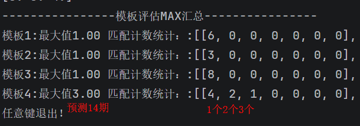

# AI彩票预测模型

<div align="center">
  <a href="#english-version">English Version</a> | <a href="#chinese-version">中文版</a>
</div>

---

## English Version

### Project Overview
This is an open-source learning project for AI lottery prediction, developed for educational purposes only. We accidentally discovered that AI models trained on lottery data showed surprisingly good prediction capabilities. However, we strongly emphasize that lottery prediction is for academic research only and should never be used for commercial purposes or investment decisions.

### Key Discoveries
- Trained on all lottery data from 2009 onwards
- Predicts the next 14 days of China Sports Lottery Pick 3 (体彩排列3)
- Best model performance: 4 days with 1 correct number, 2 days with 2 correct numbers, and 1 day with all 3 correct numbers
- Another model consistently predicted 1 correct number for 8 consecutive days
- Uses Transformer model with custom evaluation functions
- Verified no future data leakage


*AI prediction example showing prediction results visualization*

### Disclaimer
⚠️ **IMPORTANT WARNING** ⚠️
- Lottery prediction is inherently uncertain and risky
- This project is for educational purposes only
- **DO NOT use for any commercial activities**
- **DO NOT use for investment decisions**
- The project developers are not responsible for any losses incurred

### Technical Stack
- Python 10
- TensorFlow 2.10
- SQL Server
- Transformer models
- CUDA (for GPU acceleration)

### System Requirements
- **GPU-equipped computer** (required for model training and inference)
- SQL Server database

### Installation & Configuration

#### Database Setup
1. Install SQL Server database
   - **Windows**: Download from [Microsoft SQL Server Official Download](https://www.microsoft.com/en-us/sql-server/sql-server-downloads)
   - **Linux/macOS**: Use Docker to run SQL Server:
     ```bash
     # Run SQL Server in Docker
     docker run -e "ACCEPT_EULA=Y" -e "SA_PASSWORD=YourPassword123" -p 1433:1433 --name sqlserver -d mcr.microsoft.com/mssql/server:2022-latest
     ```
   - Or use SQL Server Express (Free): [SQL Server Express Download](https://www.microsoft.com/en-us/sql-server/sql-server-downloads#express)
2. Restore the database backup from `db/caipiaodb.bak`

**Command Line Restore (using sqlcmd):**
```bash
# Restore database using command line
sqlcmd -S localhost -U sa -P YourPassword -Q "RESTORE DATABASE [caipiaodb] FROM DISK = 'db\caipiaodb.bak' WITH REPLACE"

# Alternative with Windows Authentication
sqlcmd -S localhost -E -Q "RESTORE DATABASE [caipiaodb] FROM DISK = 'db\caipiaodb.bak' WITH REPLACE"
```

**SQL Server Management Studio (SSMS) Restore:**
1. Open SSMS and connect to your SQL Server instance
2. Right-click on "Databases" → "Restore Database"
3. Select "Device" as the source
4. Click "Add" and browse to `db/caipiaodb.bak`
5. Click "OK" to restore

3. Configure database connection string in `config.py`

#### Environment Setup

**Installation Environment Overview:**
This project requires Python 3.10.11 + TensorFlow 2.10.1 for optimal compatibility. The installation process includes database setup (SQL Server), Python environment configuration, and TensorFlow installation. Windows users are recommended to use the pre-configured environment or install TensorFlow 2.10.1 specifically. Linux/macOS users have more flexible version options. GPU support is recommended for better training performance.

**Quick Start Guide:**
1. **Database**: Install SQL Server and restore backup from `db/caipiaodb.bak`
2. **Python Environment**: Use Python 3.10.11 for Windows, Python 3.10+ for Linux/macOS  
3. **TensorFlow**: Windows requires TensorFlow 2.10.1 specifically, Linux/macOS flexible
4. **Dependencies**: Install all packages from `requirements.txt`

##### Method 1: Manual Configuration

**For Windows Users (Recommended):**
1. Install Python 3.10.11 (recommended version for this project)
2. **IMPORTANT**: Install TensorFlow 2.10.1 specifically (not other versions):
   ```bash
   pip install tensorflow==2.10.1
   ```
   - This version is optimized for Windows + Python 3.10.11
   - Using other TensorFlow versions may cause compatibility issues
   
   **If pip installation cannot find the required version, you can manually install local TensorFlow:**
   - Download the local installation package from cloud storage:
     - **File**: `tensorflow_gpu-2.10.1-cp310-cp310-win_amd64.whl`
     - **Link**: https://pan.baidu.com/s/13PeTy7Tb-Sdc77awgzmQ2w?pwd=2qj4
     - **Extraction code**: 2qj4
   - Manual installation:
     ```bash
     pip install tensorflow_gpu-2.10.1-cp310-cp310-win_amd64.whl
     ```

3. Install CUDA compatible with TensorFlow 2.10 (if using GPU)
   - **CUDA + cuDNN Installation Guide**: [TensorFlow GPU Support](https://www.tensorflow.org/install/gpu)
   - **CUDA Toolkit 11.8 Download**: [CUDA 11.8](https://developer.nvidia.com/cuda-11-8-0-download-archive)
   - **cuDNN v8.6 Download**: [cuDNN Library](https://developer.nvidia.com/rdp/cudnn-download)
4. Install remaining dependencies from `requirements.txt`

**For Linux/macOS Users:**
1. Install Python 3.10+
2. Install main dependencies (flexible versions):
   ```bash
   # Create virtual environment
   python -m venv venv
   
   # Activate virtual environment
   # On Windows:
   venv\Scripts\activate
   # On macOS/Linux:
   source venv/bin/activate
   
   # Install main dependencies (versions can vary)
   pip install tensorflow numpy pandas scikit-learn matplotlib pymssql
   ```

**Complete Installation (All Platforms):**
```bash
# Install all dependencies
pip install -r requirements.txt
```

**Key Dependencies Version:**
- TensorFlow 2.10.1 (Python 3.10.11 compatible)
- NumPy 1.24.2 (Scientific computing)
- Scikit-learn 1.2.2 (Machine learning)
- Pandas 1.5.3 (Data manipulation)
- Matplotlib 3.7.1 (Visualization)
- pymssql 2.2.7 (SQL Server connectivity)

##### Method 2: Pre-configured Environment (Windows only)
1. Download the pre-configured environment from Baidu Netdisk:
   - Link: `https://pan.baidu.com/s/1cCKQ2zNqeN0B-f16bEzNAw?pwd=9ezr`
   - Extraction code: 9ezr
2. **Set up Windows System Environment Variables:**
   - Extract Python 3.10.11 to `C:\Python310`
   - **Add to PATH environment variable:**
     ```
     C:\Python310
     C:\Python310\Scripts
     C:\Python310\Lib\site-packages
     ```
   - **Set AICuda environment paths:**
     ```
     C:\AICuda\bin
     ```
   - **Verification**: Open Command Prompt and run `python --version` to confirm Python 3.10.11 is accessible
   **Note**: The pre-configured tensorflow9 environment already includes all required dependencies, including TensorFlow.
3. **Activate TensorFlow 9 Virtual Environment:**
   ```bash
   # Navigate to project directory
   cd /path/to/your/project
   
   # Activate the pre-configured tensorflow9 environment
   E:\AI\tensorflow9\Scripts\activate
   ```

4. **Run the main program:**
   ```bash
   python CaiAi3PNew.py
   ```

### Usage Instructions

#### Main Program
- Main program: `CaiAi3PNew.py`
- Run directly to start training or prediction

#### Key Parameters
```python
# Prediction model ID (when IsFix=False)
sup.dset.guid = "model_id_from_mainlist"

# True: Start training; False: Predictions
sup.dset.IsFix = True

# Model type (from AiModels.py GetModel method)
sup.dset.tfModelType = "model_name"

# For custom data training
sup.dset.LeftNum = 2  # Number of prefix columns (issue number, date, etc.)
sup.dset.OutNum = 3   # Number of output columns (actual results)
```

#### Model Path
- China Sports Lottery Pick 3 model path: `SaveModels/AiCaiData3PNew/FixModels`
- Model list: `SaveModels/AiCaiData3PNew/mainlist`


*Model performance statistics and template analysis*

#### Important Notes
1. Input data only needs to be 2D features - the program automatically processes it into time series input shape
2. For China Sports Lottery Pick 3, the optimal historical review days is 30
3. Recommended model: `l_cai_hierarchical_l2`
4. Prediction output shows the next period's data based on the current input period

### Custom Data Training
1. Prepare your lottery data in SQL Server
2. Write SQL queries to get 2D feature data
3. Configure `LeftNum` and `OutNum` parameters according to your data structure
4. Run the training process

### Contact
For questions or custom requirements:
- WeChat Customer Service: `https://work.weixin.qq.com/kfid/kfcd871154619f798d8`

---

## Chinese Version

### 项目概述
这是一个用于AI彩票预测的开源学习项目，仅用于教育目的。我们在测试模型时偶然发现，使用彩票数据训练的AI模型展现出了令人惊讶的预测能力。然而，我们强烈强调，彩票预测仅用于学术研究，绝不能用于商业目的或投资决策。

### 重要发现
- 训练数据包含2009年以来的所有彩票数据
- 预测未来14天的体彩排列3结果
- 最佳模型表现：4天中1个数，2天中2个数，1天中3个数
- 另一个模型连续8天每天中1个数
- 使用Transformer模型和自定义评估函数
- 已验证未使用未来数据

### 免责声明
⚠️ **重要警告** ⚠️
- 彩票预测本质上具有不确定性和风险性
- 本项目仅用于教育目的
- **禁止用于任何商业活动**
- **禁止用于投资决策**
- 项目开发者对任何损失不承担责任

### 技术栈
- Python 10
- TensorFlow 2.10
- SQL Server
- Transformer模型
- CUDA (GPU加速)

### 系统要求
- **配备GPU的电脑** (模型训练和推理必需)
- SQL Server数据库

### 安装与配置

#### 数据库设置
1. 安装SQL Server数据库
   - **Windows**: 下载地址：[Microsoft SQL Server 官方下载](https://www.microsoft.com/zh-cn/sql-server/sql-server-downloads)
   - **Linux/macOS**: 使用Docker运行SQL Server：
     ```bash
     # 在Docker中运行SQL Server
     docker run -e "ACCEPT_EULA=Y" -e "SA_PASSWORD=YourPassword123" -p 1433:1433 --name sqlserver -d mcr.microsoft.com/mssql/server:2022-latest
     ```
   - 或使用SQL Server Express（免费版）：[SQL Server Express 下载](https://www.microsoft.com/zh-cn/sql-server/sql-server-downloads#express)
2. 还原`db/caipiaodb.bak`中的数据库备份

**数据库还原方法一：命令行还原（使用sqlcmd）：**
```bash
# 使用命令行还原数据库
sqlcmd -S localhost -U sa -P 你的密码 -Q "RESTORE DATABASE [caipiaodb] FROM DISK = 'db\caipiaodb.bak' WITH REPLACE"

# Windows身份验证方式
sqlcmd -S localhost -E -Q "RESTORE DATABASE [caipiaodb] FROM DISK = 'db\caipiaodb.bak' WITH REPLACE"
```

**数据库还原方法二：SQL Server Management Studio (SSMS) 还原：**
1. 打开SSMS并连接到SQL Server实例
2. 右键点击"数据库" → "还原数据库"
3. 选择"设备"作为源
4. 点击"添加"并浏览到`db/caipiaodb.bak`
5. 点击"确定"进行还原

3. 在`config.py`中配置数据库连接字符串

#### 环境设置

**安装环境总结简介：**
本项目需要Python 3.10.11 + TensorFlow 2.10.1以获得最佳兼容性。安装过程包括数据库设置（SQL Server）、Python环境配置和TensorFlow安装。Windows用户推荐使用预配置环境或专门安装TensorFlow 2.10.1版本。Linux/macOS用户有更灵活的版本选项。推荐使用GPU支持以获得更好的训练性能。

**快速开始指南：**
1. **数据库**：安装SQL Server并从`db/caipiaodb.bak`恢复备份
2. **Python环境**：Windows使用Python 3.10.11，Linux/macOS使用Python 3.10+
3. **TensorFlow**：Windows需专门安装TensorFlow 2.10.1，Linux/macOS版本灵活
4. **依赖项**：从`requirements.txt`安装所有包

##### 方法一：手动配置

**Windows用户（推荐）：**
1. 安装Python 3.10.11（项目推荐版本）
2. 专门安装TensorFlow 2.10.1版本：
   ```bash
   pip install tensorflow==2.10.1
   ```
   
   **如果pip安装未找到相关版本，可以手动安装本地TensorFlow：**
   - 从网盘下载本地安装包：
     - **文件**: `tensorflow_gpu-2.10.1-cp310-cp310-win_amd64.whl`
     - **链接**: https://pan.baidu.com/s/13PeTy7Tb-Sdc77awgzmQ2w?pwd=2qj4
     - **提取码**: 2qj4
   - 手动安装：
     ```bash
     pip install tensorflow_gpu-2.10.1-cp310-cp310-win_amd64.whl
     ```

3. 安装与TensorFlow 2.10兼容的CUDA（如果使用GPU）
   - **CUDA + cuDNN 安装教程**: [TensorFlow GPU支持](https://www.tensorflow.org/install/gpu)
   - **CUDA Toolkit 11.8 下载**: [CUDA 11.8](https://developer.nvidia.com/cuda-11-8-0-download-archive)
   - **cuDNN v8.6 下载**: [cuDNN 库](https://developer.nvidia.com/rdp/cudnn-download)
4. 从`requirements.txt`安装其余依赖

**Linux/macOS用户：**
1. 安装Python 3.10+
2. 安装主要依赖库（版本灵活）：
   ```bash
   # 创建虚拟环境
   python -m venv venv
   
   # 激活虚拟环境
   # Windows系统：
   venv\Scripts\activate
   # macOS/Linux系统：
   source venv/bin/activate
   
   # 安装主要依赖（版本可灵活）
   pip install tensorflow numpy pandas scikit-learn matplotlib pymssql
   ```

**完整安装（所有平台）：**
```bash
# 安装所有依赖
pip install -r requirements.txt
```

**关键依赖版本：**
- TensorFlow 2.10.1 (Python 3.10.11兼容)
- NumPy 1.24.2 (科学计算)
- Scikit-learn 1.2.2 (机器学习)
- Pandas 1.5.3 (数据处理)
- Matplotlib 3.7.1 (数据可视化)
- pymssql 2.2.7 (SQL Server连接)

##### 方法二：下载预配置环境 (仅Windows)
1. 从百度网盘下载预配置环境：
   - 链接: `https://pan.baidu.com/s/1cCKQ2zNqeN0B-f16bEzNAw?pwd=9ezr`
   - 提取码: 9ezr
2. **设置Windows系统环境变量：**
   - 将Python 3.10.11解压到`C:\Python310`
   - **添加到PATH环境变量：**
     ```
     C:\Python310
     C:\Python310\Scripts
     C:\Python310\Lib\site-packages
     ```
   - **设置AICuda环境路径：**
     ```
     C:\AICuda\bin
     ```
   - **验证**：打开命令提示符，运行`python --version`确认Python 3.10.11可访问
   **注意**：预配置的tensorflow9环境已经包含了所有必要的依赖包，包括TensorFlow，无需额外安装。
3. **激活TensorFlow 9虚拟环境：**
   ```bash
   # 导航到项目目录
   cd /path/to/your/project
   
   # 激活预配置的tensorflow9环境
   E:\AI\tensorflow9\Scripts\activate
   ```

4. **运行主程序：**
   ```bash
   python CaiAi3PNew.py
   ```

### 使用说明

#### 主程序
- 主程序：`CaiAi3PNew.py`
- 直接运行开始训练或预测

#### 关键参数
```python
# 预测模型ID（当IsFix=False时）
sup.dset.guid = "mainlist中的模型ID"

# True：开始训练；False：预测
sup.dset.IsFix = True

# 模型类型（来自AiModels.py的GetModel方法）
sup.dset.tfModelType = "模型名称"

# 自定义数据训练配置
sup.dset.LeftNum = 2  # 前置列数，即期号日期等标识字段
sup.dset.OutNum = 3   # 输出列数，即真实结果值
```

#### 模型路径
- 体彩排列3模型路径：`SaveModels/AiCaiData3PNew/FixModels`
- 模型列表：`SaveModels/AiCaiData3PNew/mainlist`

#### 重要说明
1. 数据查询输入只需要二维特征，程序已自动处理成时间序列输入形状
2. 体彩排列3最佳历史回顾天数为30
3. 推荐模型：`l_cai_hierarchical_l2`
4. 预测输出显示的期号为当前输入数据期号预测的是下一期的数据

### 自定义数据训练
1. 在SQL Server中准备你的彩票数据
2. 编写SQL查询获取二维特征数据
3. 根据你的数据结构配置`LeftNum`和`OutNum`参数
4. 运行训练过程

### 联系方式
如有疑问或定制化需求：
- 微信客服：`https://work.weixin.qq.com/kfid/kfcd871154619f798d8`

---

## License
Creative Commons Attribution-NonCommercial-ShareAlike 4.0 International (CC BY-NC-SA 4.0)

This license is chosen because:
- **NonCommercial**: Prohibits commercial use, aligning with our project's educational-only purpose
- **Attribution**: Requires proper credit to the original authors
- **ShareAlike**: Ensures any modifications are shared under the same non-commercial terms
- **Strong protection**: Prevents misuse for commercial or investment purposes while allowing open learning and modification

For the full license text, see the [LICENSE](LICENSE) file.

## Copyright
© 2025 Witplay AI Lottery Prediction Project Team
